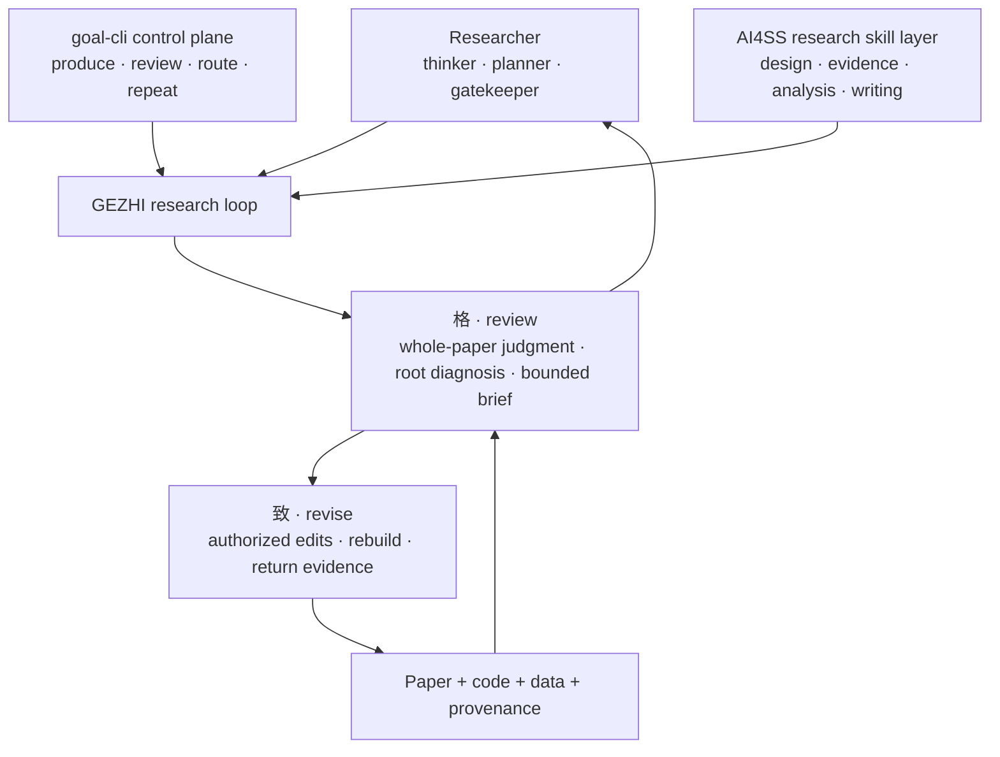

<!-- markdownlint-disable MD013 MD033 MD041 -->

<p align="center">
  
</p>

<h1 align="center">GEZHI · 格致</h1>

<p align="center">
  <strong>A scholar-centered agent architecture for empirical social-science research.</strong>
</p>

<p align="center">
  Keep research judgment traceable, reviewable, and verifiable.
</p>

<p align="center">
  <a href="#why-gezhi"><strong>Why GEZHI</strong></a>
  &nbsp;/&nbsp;
  <a href="#architecture">Architecture</a>
  &nbsp;/&nbsp;
  <a href="#quick-start">Quick Start</a>
  &nbsp;/&nbsp;
  <a href="#current-implementation">Implementation</a>
  &nbsp;/&nbsp;
  <a href="README.zh-CN.md">中文</a>
</p>

<p align="center">
  <a href="https://github.com/SiyaoZheng/GEZHI/stargazers"></a>
  
  
  <a href="LICENSE"></a>
</p>

> [!NOTE]
> **GEZHI is the public project.** The runtime command and Python package remain
> named **`goal-cli`** so existing projects do not break.

## Why GEZHI

AI can retrieve literature, organize evidence, clean data, write code, and
format manuscripts. But a social-science paper is not a checklist of tasks. It
is a chain of judgments about theory, design, measurement, evidence, inference,
and the boundaries of a credible claim.

GEZHI organizes agents around those judgments.

It gives repetitive execution to AI while keeping the researcher at the
architecture layer—as thinker, planner, and gatekeeper.

## Architecture



| Layer | Responsibility |
| --- | --- |
| **Research architecture** | The researcher decides what matters, plans the research path, and guards evidentiary and inferential boundaries. |
| **Scholarly capability** | The AI4SS skill layer supports research design, evidence construction, analysis review, and academic writing. |
| **Control plane** | `goal-cli` rebuilds the artifact, requests review, persists the decision, and schedules the next bounded pass. |

## 格 and 致

### 格 · judge the whole

`格` reviews the current paper as one integrated argument.

- cover the full scholarly object, not a sequence of mechanical stages;
- make judgments, not just scores;
- diagnose one root problem, not a pile of surface symptoms;
- return evidence and explicit completion conditions.

### 致 · revise within bounds

`致` receives the active scholarly focus and performs a bounded revision.

- edit only authorized source files;
- rebuild the paper and analysis rather than claiming completion in chat;
- preserve data, code, and provenance as inspectable evidence;
- return the new artifact to `格` for another whole-paper judgment.

## Quick Start

Install the current GEZHI control plane from this repository:

```bash
python3 -m pip install "goal-cli[openai] @ git+https://github.com/SiyaoZheng/GEZHI.git"
goal-cli --help
```

Then give your coding agent one entrypoint:

```text
Read https://github.com/SiyaoZheng/GEZHI/blob/main/llms.txt and configure this project as a GEZHI research loop.
```

For a first run, inspect the generated configuration before allowing an agent
to edit research source:

```bash
goal-cli validate
goal-cli doctor
goal-cli run --dry-run
```

## Current Implementation

This repository currently ships the control-plane implementation used by
GEZHI. The compatibility name `goal-cli` remains visible in commands, package
paths, and configuration.

| Path | Role in GEZHI |
| --- | --- |
| [`src/goal_cli/`](src/goal_cli/) | Persistent artifact-first control loop |
| [`goal-cli-project-setup`](skills/goal-cli-project-setup/SKILL.md) | Connect an existing research project to the GEZHI control loop |
| [`goal-cli-template-author`](skills/goal-cli-template-author/SKILL.md) | Improve reusable project templates, checks, and examples |
| [`examples/scientificity/`](examples/scientificity/) | Empirical-paper example with executable checks |
| [`docs/config-schema.md`](docs/config-schema.md) | Full `goal.toml` contract |
| [`docs/cli-reference.md`](docs/cli-reference.md) | Current command reference |
| [`docs/artifact-goal-notes.md`](docs/artifact-goal-notes.md) | Control-plane design rationale |

## Non-negotiables

- **The artifact is the object of evaluation.** Agent activity is not evidence
  of research progress.
- **No invented evidence.** Missing information stays missing and constrains
  the claim.
- **One active root focus.** Revision effort stays bounded and auditable.
- **Researcher responsibility remains human.** GEZHI does not replace
  authorship, research ethics, or independent verification.
- **Every pass leaves a trail.** Paper, code, data, provenance, review, and
  decision remain inspectable.

## Status

GEZHI is active research software. Its present public implementation is most
useful for completed empirical social-science projects with executable
analysis, a canonical paper artifact, and explicit evidence boundaries.

The architecture is deliberately conservative: it can make an agent workflow
more persistent and inspectable, but it cannot make a weak design, missing
data, or an unsupported claim credible.

## Project Links

- **Repository:** [github.com/SiyaoZheng/GEZHI](https://github.com/SiyaoZheng/GEZHI)
- **Author:** [siyaozheng.org](https://siyaozheng.org)
- **Issues:** [GEZHI issue tracker](https://github.com/SiyaoZheng/GEZHI/issues)
- **Security:** [SECURITY.md](SECURITY.md)

## License

[MIT](LICENSE)
