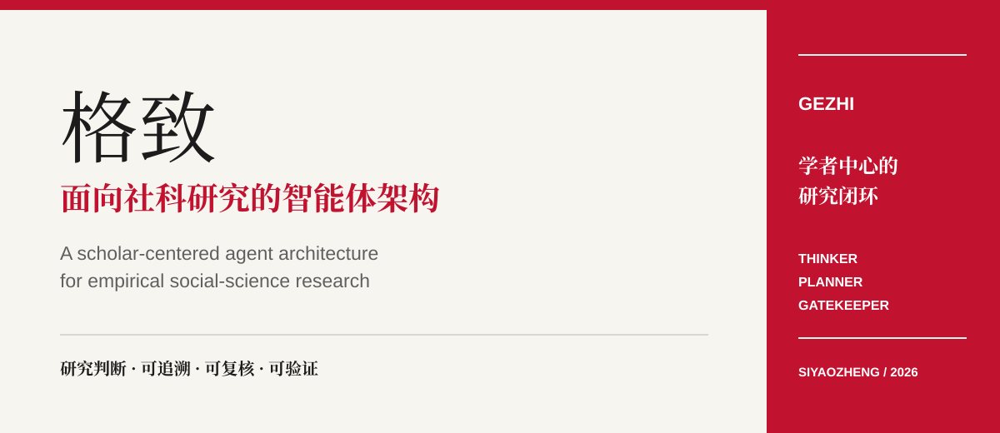
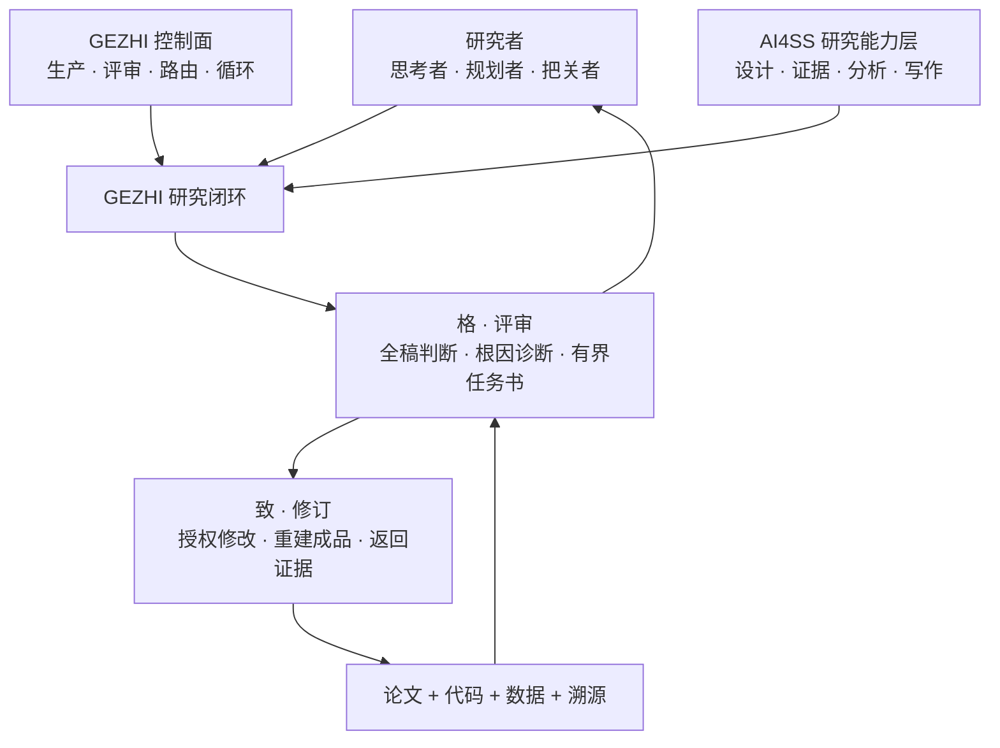

<!-- markdownlint-disable MD013 MD033 MD041 -->

<p align="center">
  
</p>

<h1 align="center">格致 · GEZHI</h1>

<p align="center">
  <strong>面向实证社会科学研究的学者中心智能体架构</strong>
</p>

<p align="center">
  让研究判断可追溯、可复核、可验证。
</p>

<p align="center">
  <a href="#为什么需要格致"><strong>为什么</strong></a>
  &nbsp;/&nbsp;
  <a href="#系统架构">架构</a>
  &nbsp;/&nbsp;
  <a href="#快速开始">快速开始</a>
  &nbsp;/&nbsp;
  <a href="#当前实现">当前实现</a>
  &nbsp;/&nbsp;
  <a href="README.md">English</a>
</p>

<p align="center">
  <a href="https://github.com/SiyaoZheng/GEZHI/stargazers"></a>
  
  
  <a href="LICENSE"></a>
</p>

## 为什么需要格致

AI 可以检索文献、整理证据、清洗数据、编写代码，也可以协助写作与排版。
但一篇社会科学论文不是任务清单，而是一连串关于理论、设计、测量、证据、
推断与论断边界的判断。

格致把智能体组织在这些判断周围。

重复执行交给 AI，研究者则回到架构层，承担思考者、规划者与把关者的职责。

## 系统架构



| 层次 | 职责 |
| --- | --- |
| **研究架构层** | 研究者决定什么值得研究，规划研究路径，并把关证据与推断边界。 |
| **学术能力层** | AI4SS 能力层支持研究设计、证据构建、分析审查与学术写作。 |
| **运行控制面** | `gezhi` 重建成品、发起评审、持久化判断，并调度下一次有界工作。 |

## 格与致

### 格 · 审全稿

`格` 把当前论文当作一个完整论证来审查。

- 保证学术关切的覆盖，而不是机械地依次过阶段；
- 做判断，而不是只给分；
- 诊断一个根本问题，而不是罗列表面症状；
- 给出证据与明确的完成条件。

### 致 · 有界修订

`致` 接收当前学术焦点，并完成一次边界清楚的修订。

- 只修改获得授权的源文件；
- 重建论文与分析，不以聊天里的“完成”代替成品；
- 把数据、代码与溯源保留为可检查证据；
- 把新成品交还给 `格`，再次进行全稿判断。

## 快速开始

从本仓库安装格致目前使用的控制面：

```bash
python3 -m pip install "gezhi[openai] @ git+https://github.com/SiyaoZheng/GEZHI.git"
gezhi --help
```

然后把唯一入口交给 coding agent：

```text
Read https://github.com/SiyaoZheng/GEZHI/blob/main/llms.txt and configure this project as a GEZHI research loop.
```

如果手动配置，第一次运行前先创建并编辑配置，再检查环境：

```bash
gezhi init
# 编辑 gezhi.toml：设置成品、构建命令、评审方式与可写源码范围。
gezhi validate
gezhi doctor
gezhi run --dry-run
```

## 当前实现

本仓库以一套统一身份发布格致：Python distribution、import package 与命令均为
`gezhi`；项目配置为 `gezhi.toml`，运行状态保存在 `.gezhi/`。

运行时把评审角色称为 `tik`，把有界源码修订角色称为 `tok`。在格致架构中，
二者分别支撑“格”与“致”，是运行角色名，而不是另外两个产品。

| 路径 | 在格致中的作用 |
| --- | --- |
| [`src/gezhi/`](src/gezhi/) | 持久运行、以成品为中心的控制循环 |
| [`gezhi-project-setup`](skills/gezhi-project-setup/SKILL.md) | 把现有研究项目接入 GEZHI 控制循环 |
| [`gezhi-template-author`](skills/gezhi-template-author/SKILL.md) | 改进可复用模板、检查与示例 |
| [`examples/scientificity/`](examples/scientificity/) | 带可执行检查的实证论文示例 |
| [`docs/config-schema.md`](docs/config-schema.md) | 完整 `gezhi.toml` 契约 |
| [`docs/cli-reference.md`](docs/cli-reference.md) | 当前命令说明 |
| [`docs/architecture.md`](docs/architecture.md) | 控制面设计说明 |
| [`docs/migration.md`](docs/migration.md) | 从旧运行时身份进行 hard cut 的迁移说明 |

## 不可妥协的原则

- **评估对象是成品。** 智能体做了多少事，不等于研究取得了多少进展。
- **不编造证据。** 缺失信息必须继续缺失，并限制论断边界。
- **一次聚焦一个根本问题。** 修订范围必须有界、可审计。
- **研究责任仍属于研究者。** 格致不替代作者责任、研究伦理与独立核验。
- **每一轮都留下证据链。** 论文、代码、数据、溯源、评审与判断都可检查。

## 项目状态

格致目前是活跃开发中的研究软件，最适合具有可执行分析、唯一正式论文成品和
清楚证据边界的已完成实证社会科学项目。

它能够让智能体工作流更持久、更透明，但不能把薄弱设计、缺失数据或无证据支持
的论断变得可信。

## 项目链接

- **代码仓库：** [github.com/SiyaoZheng/GEZHI](https://github.com/SiyaoZheng/GEZHI)
- **作者主页：** [siyaozheng.org](https://siyaozheng.org)
- **问题反馈：** [GEZHI issue tracker](https://github.com/SiyaoZheng/GEZHI/issues)
- **安全说明：** [SECURITY.md](SECURITY.md)

## 许可协议

[MIT](LICENSE)
